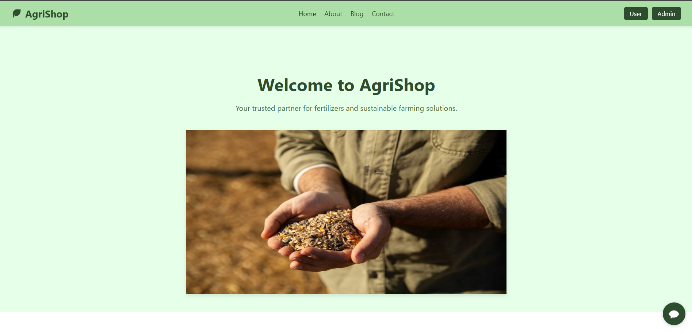

# 🌾 AgriShop – Smart Agriculture E-Commerce Platform

AgriShop is a web-based platform designed to simplify the purchase and management of agricultural products. It serves as a one-stop solution for both farmers and customers, offering product listings, blogs, user management, and admin controls in an intuitive and user-friendly interface.

---

## 🚀 Features

### 👨‍🌾 For Users
- 🔐 User Registration & Login
- 🛒 View & Purchase Agricultural Products
- 🧾 Add to Cart 
- 📚 Read Blog Posts Related to Farming & Fertilizers

### 🔐 Admin Dashboard
- 📦 Add, Edit, or Remove Products
- 📝 Post Blogs with Images
- 🧑 Manage Users 
- 🧭 Navigate via Admin Blog Dashboard

---

## 🛠️ Tech Stack

- **Frontend**: HTML, CSS, JavaScript  
- **Backend**: PHP  
- **Database**: MySQL  
- **Version Control**: Git & GitHub  
- **Tools**: XAMPP / Apache Server

---
**Home page**

